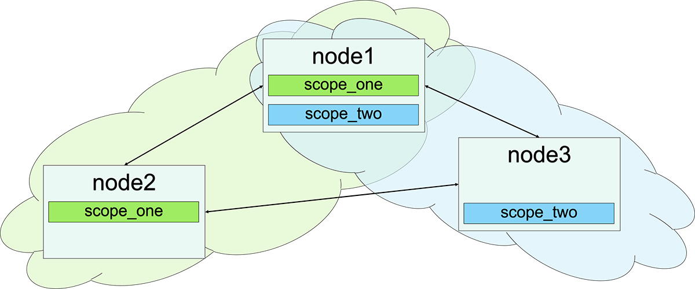

spg: Scalable Process Groups
=====

Replacement for Erlang/OTP pg2 implementation. Implements Strong Eventual 
Consistency (SEC), and an overlay network over Erlang Distribution Cluster.

Primary purpose of this application is to support service discovery.

## Design & Implementation
Terminology
* *Node*. Instance of Erlang Run Time System (ERTS) running in a distributed
environment.
* *Process*. Erlang process running on a single node.
* Process *Owner*. Node that hosts the process.
* *Group*. Collection of processes that can be accessed by a common name. One
process may participate in multiple groups, or in the same group multiple
times.
* *Scope*. Name of the overlay network running on top of Erlang distribution
cluster.

All nodes running spg process with the same scope name form an overlay network




Join/leave calls must be done by the process running on the joining/leaving
process owner node.

## API

To discover services provided within some overlay network, it is necessary to
join this network. Default application startup creates a single default overlay
network named 'spg'. This network can be used with short API version:

 * **join(Group, PidOrPids)** - joins single process or many processes to the specified group, it is allowed to
 join the same process several times. All processes must be local the the node. Group may or may not
 exist (in this case group name is created automatically)
 * **leave(Group, PidOrPids)** - removes process or processes from the group. Processes must be local to the node.
 * **get_members(Group)** - returns all processes that are a member of a specified group.
 * **get_local_members(Group)** - return all processes, that are a member of a group, and are local to this node.
 * **which_groups()** - returns a list of all groups know to this node
 * **which_local_groups()** - returns a list of all groups that this node has published at least one process in

A node may need to join multiple overlay networks. This can be done using
spg application configuration variable (scopes), and spg application supervisor
will automatically join these networks.

It's possible to start the scope dynamically, using ```spg:start_link(ScopeName)```,
or adding spg scope process as a child of your supervisor.

Same API, with scope (overlay network) name as a first argument, should be used to join and leave groups
belonging to that scope.

## Implementation details
Below are implementation details, subject to change without further notice.

### Overlay network discovery protocol

1. bootstrap:  
   monitor cluster membership  
   broadcast ```{discover, self()}``` to this spg scope on all nodes()
2. handle discover request:  
   monitor requesting process  
   respond with ```{sync, self(), [{Group, LocalPids}]}```
3. handle monitor ‘DOWN’ for remote spg scope process:  
   remove all processes from disconnected scope
4. handle ‘nodeup’: send ```{discover, self()}``` to spg scope of a joined node

### Join/leave protocol

Join/leave calls are routed through local spg scope process.
Local processes joined the group are monitored. When spg scope detects
monitored process exit, ```leave``` message is sent to all nodes of an
overlay network.

Handling remote spg scope ‘DOWN’ includes removal of all processes 
owned by remote node from the scope.

Join/leave operations contain originating scope process. This speeds up
handling of node/scope down/up notifications. Tests were performed on a
cluster of 5,000 machines, and up to 150,000 processes joining ~5,000 different groups
within a single scope.

If you need to handle more groups and processes, it is advised to run multiple
scopes. It is more efficient to have 10 scopes with 100 groups than 1 scope with
1000 groups, due to concurrent processing allowed when running multiple scope processes.

Relies on message ordering done by Erlang distribution. All exchanges are happening only between
corresponding spg gen_server processes.


## Build
This project has no compile-time or run-time dependencies.

    $ rebar3 compile

### Running tests
Smoke tests are implemented in spg_SUITE.
Running any tests will fetch additional libraries as dependencies. This is only
necessary to run the benchmarks (that are disabled by default). Running smoke
tests is as easy as:
    
    $ rebar3 ct --cover && rebar3 cover --verbose

Running property-based tests (takes up to 24 hours):

    $ rebar3 ct --suite spg_cluster_SUITE

This suite uses PropEr library to simulate all possible state changes. 
Unfortunately, OTP Common Test application suffers from issues preventing
using 'cover' tool with multiple slave nodes starting and shutting down 
rapidly. Thus coverage reports are turned off by default.


### Formal model
Used by PropEr library to generate stateful test call sequence.

Generated events:
 * start peer node (up to some limit)
 * stop peer node
 * connect to peer node (distribution cluster)
 * disconnect from peer node (distribution cluster)
 * start spc scope process
 * stop spg scope process
 * spawn process on any node in the cluster
 * register process in a group (join)
 * register multiple processes in a group (multi-join)
 * leave group
 * multi-leave
 
Properties:
 * group contains all processes that joined the group on all dist-visible nodes running the same scope
 * group does not contain any other processes (e.g. exited or connected transitively)

## Feature requests
Feature requests that are being considered (feel free to submit PR implementing any of these):
 * separate in/out queues for remote join/leave casts for improved performance
 * alternative process registry support
 * delayed ‘DOWN’ processing to tolerate short network disruptions
 * alternative service discovery integration 
 * region-aware scoping
 * non-process values
 * health checks

## Changelog

Version 1.2:
 - updated for OTP 25 support (property-based test requires OTP 25 now)
 - removed benchmarking suites, generic cleanup

Version 1.1.2:
 - updated stateful property-based test to run multiple instances in parallel

Version 1.1.1:
 - revised tests to allow larger amount of nodes for property-based testing

Version 1.1.0:
 - speed up initial sync at the expense of leave/join operations
 - return not_joined for leave_group if process has not joined the group before

Version 1.0.0:
 - initial release
